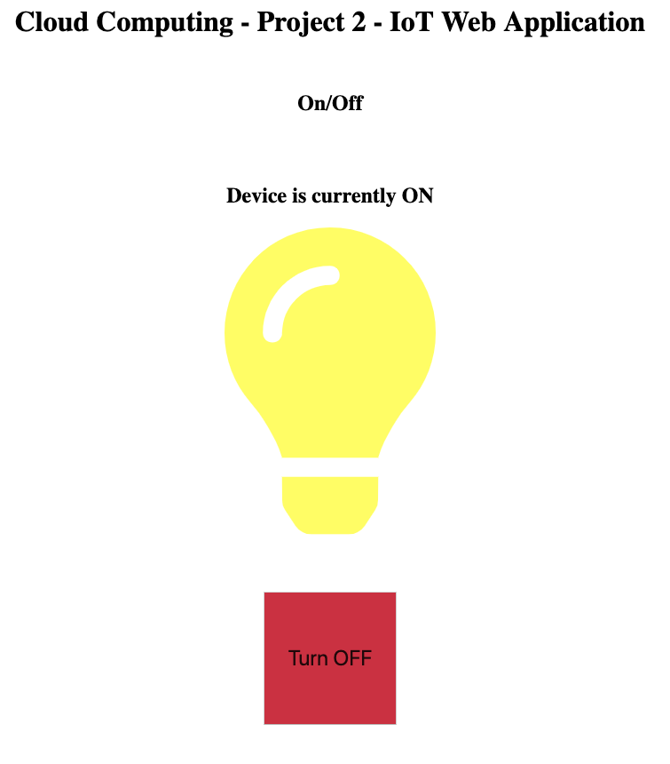
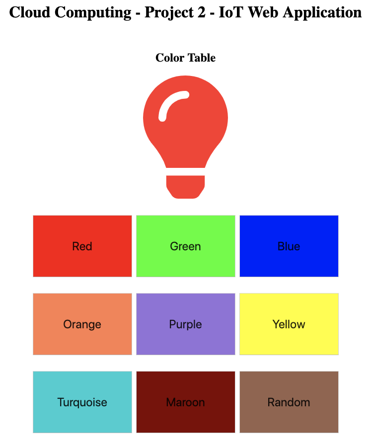
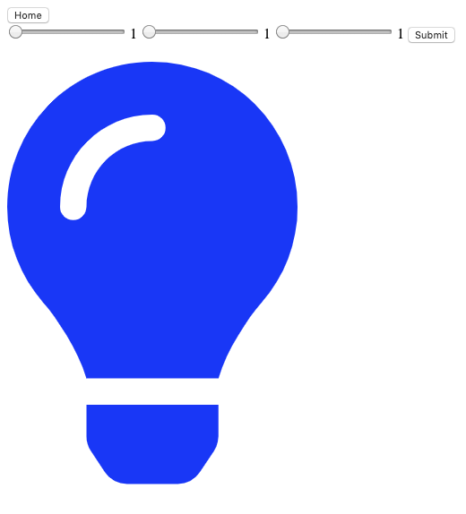
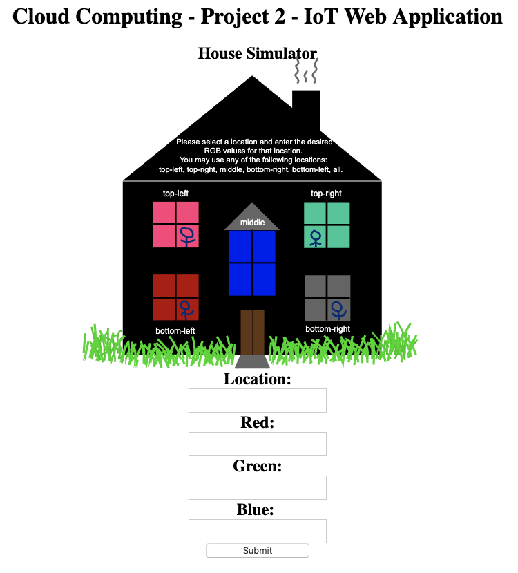

# Cloud-Based IoT Web API
Cloud-serviced web application aimed to manage and utilize Internet-of-Things devices using Python, Amazon AWS, and a MySQL Database.

Specifications: https://lecturer-russ.appspot.com/classes/cs346/spring19/projects/proj02.pdf


# Contributors
Adrian Bao - https://github.com/BaoAdrian <br>
Mauricio Herrera - https://github.com/mauherrerag <br>
Ruben Tequida - https://github.com/rtequida21 <br>


### Videos
Introduction: https://www.youtube.com/watch?v=96-rTpchbnE <br>
Further Exploration: https://www.youtube.com/watch?v=RG9L3w1t6TM


<br>


# Project Description
There are three main parts for this application. 
<ol>
  <li> MySQL Database </li>
  <li> Amazon EC2 Instances Running Apache Webserver </li>
  <li> Python/HTML Web Application </li>
</ol>

This project will utilize the Amazon AWS Platform to spin up two mirrored EC2 Instances running Apache Webserver and one RDS MySQL Database Instance serve as the backend data persistance for the the Python/HTML web application that will be cloned into each instance from this repository (dev folder). The Web Application that is generated through the webserver will be broadcasted to specific IP Addresses that can be accessible via a web browser. The CGI framework for Python is used to generate the HTML code for the various pages and more information on configuring that inside the instance can be found in the `README.md` inside the `dev` folder.


<br>
<br>

# Section Details
### Servers
Two mirrored Amazon EC2 Instances running Apache Webservers will have our Web Application installed from this repository into each instance. Each instance will independently point to the RDS DB Instance when connecting to MySQL Database. 

Reference: https://aws.amazon.com/ec2/

<br/>


The EC2 Instances used to run the application were the ones created from Project 2 with all configurations already set. SSH'd into the instance by running the follwing:


```
ssh -i /path/to/private-key.pem ec2-user@<Public DNS (IPv4)>
```


Once successfully inside the instance, ran the following install commands to configure the dependencies needed for this project:

```sudo yum install python3```<br/>
```sudo yum install mariadb```<br/>
```sudo yum install mariadb-devel```<br/>
```sudo yum install gcc```<br/>
```sudo yum install python3-devel``` (Required prior to pip3 install command)<br/>
```sudo pip3 install mysqlclient```<br/>
```sudo yum install git```<br/>
```sudo yum install MySQL-python``` (Used to interface with RDS DB Instance)<br/>

Note that httpd is already installed within the linux-based instance so there are no further installation requirements to be done for the webservers. (See `dev` for webserver configuration for this project).


### Amazon MySQL DB 
  https://aws.amazon.com/getting-started/tutorials/create-mysql-db/
- Amazon RDS Database Instance that will serve as the backend between the two servers that point to it. Store the various tables used throughout the application for the various simulators used to interface with (at the moment) virtual IoT devices.

<ul>  
  <li>Linking the EC2 instances to the AWS RDS DB.</li>
   - https://docs.aws.amazon.com/AmazonRDS/latest/UserGuide/CHAP_Tutorials.WebServerDB.CreateWebServer.html
  <li>W3Schools SQL.</li>
  -https://www.w3schools.com/sql/
</ul>


### Web application 
The web application will serve as a series of simulators of the application interfacing with IoT devices. The main goal with this project is to create an application that will allow for an easy introduction to interfacing with IoT devices, with our main focal point being Smart Lightbulbs.  
Will break the development into stages...  

- [x] Welcome page that serves as a starting hub to our various services (scripts below)
- [x] Simple button that controls on/off power for the bulb (on-off.py)
- [x] Presenting user with pre-configured RGB settings attached to a table of buttons (color-table.py) 
- [x] Various sliders to configure RGB settings as well as opacity and brightness (sliders.py)
= [x] Robust simulator that presents Scalable Vector Graphic of a house with various room in which the web application can interact with individual rooms and set their RGB settings. (house-simulator.py)

See the breakdown below of each individual page:

<br>

#### Welcome.py
<p>
This basic page serves as the central hub to the various "services" that our web application simulates. The user is presented with four buttons, each of which correspond to their own service (run by a python script). When each button is pressed, sends a HTTP redirect to the corresponding python script with NO parameters and generates an HTML based on a query of the database. 
</p>

<br>
<br>


#### On-off.py        
  
<p>
The simplest introduction that we could think of when integrating the various pieces of this project was turning a lightbulb on and off. We utilized a Scalable Vector Graphic (SVG) of a lightbulb that allowed for us to change the color (representive of the state) of the lightbulb. 


Upon initial loading of the script, the webpage is generated using the Query of the current state inside the database. The user is then presented with a button that controls the power of the lightbulb. Pressing the button will trigger an HTTP redirect that passes in a parameter, `status` that will be updated in the database when the webpage is loaded. Since HTML does not supported python functions to be triggered from button events, we utilized the parameters within the URL, i.e. forms, to ensure the corresponding variables were added to the URL for the following script to process.
</p>

<br>
<br>

#### Color-table.py
  
<p>
The next simulator that we dove into after figuring out how to turn a device on and off was to change its color. For this specific simulator (and also used by `slider.py`) we created a seperate table within our database that keeps track of various RGB values (as well as some placeholders for attributes such as opacity and brightness). The script generates a 3x3 grid of colored buttons, each of which is the color that represents the RGB configurations that will be sent to the database (if pressed). 


Similar to `on-off.py`, this script utilizes forms to pass arguments into the URL depending on which button is pressed. As a 'bonus' feature, we also added a button that has randomly generated RGB values that each time the webpage is loaded, a new configuration is created and displayed for the user to select. 
</p>

<br>
<br>


#### Slider.py
 
<p>
As mentioned before, this simulator communicates with the same table used by the `color-tabele.py` script. Because of this, any modification made to the database from `color-table.py` will be immediately reflected if `slider.py` webpage is accessed. This simulator was a simple introduction into using sliders and forms to, once again, integrate HTTP/args within our database queries and updates. 
</p>

<br>
<br>
<br>


#### House-simulator.py

<p>
This simulator acts independently from the other scripts and is a bit more robust in its behavior. The idea for this project was to implement an application that could easily be ported to support physical IoT devices and this is the simulator that represents that idea. It presents the user with an SVG of a house that has five windows, each window corresponds to their own IoT device. The user may utilize the form at the bottom that allows for them to select a location and configure its RGB values. Once the user presses submit, the corresponding arguments are added to the URL and sent to the script that will process the query/update to the database when required. 

Each input field has pre-set default values and can be left blank if the user chooses to do so. The `location` parameter supports individual windows (for example: `top-right` as well as `bottom-left`) but additionally supports the `all` argument that allows the user configure all the devices all at once. 
</p>


<br>
<br>


# Development - Milestones
Database:
- [x] Create MySQL DB Instance 
- [x] Link DB Instance to MySQL Workbench
- [x] Save important params for access into the python web application


Server:
- [x] Successfully launch Amazon EC2 
- [x] Install dependencies on the EC2 Instance (see above for steps to complete)
- [x] Install python application on EC2 instances
- [x] Connect DB instance to EC2 instances   


Web Application:
- [x] HTML Mockup
- [x] CGI/Python application that generates HTML
  - [x] On/Off swith
  - [x] Table of RGB Configs
  - [x] RGB/Opacity/Brightness Sliders (https://www.w3schools.com/howto/howto_js_rangeslider.asp)
  - [x] House Simulator


Future Ideas:
- Integrate Amazon IoT Core to support physical devices
  - Will need Rasberry PI for API to interface with the smart device
- Add user profiles so each user has their own respective IoT devices that they can add, control, and configure.
  - Some may have smart bulb, others may have smart tv, etc....
- Program Alexa to process commands through this web API and interact with IoT devices connected through Amazon IoT Core
