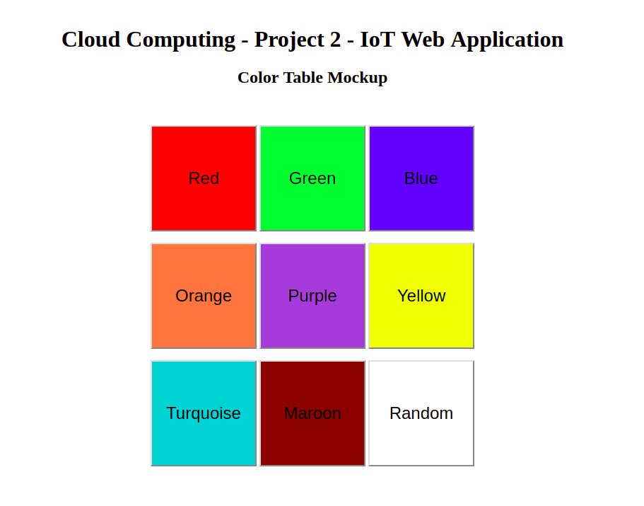

# Color Table Mockup

This is a simple mockup of possible selections we can use to configure RBG values for the lightbulb. Each button has a corresponding background color of rbg values that we can pull and feed into the database to change the state of the device.

The idea here is to integrate the following ```color-table.html``` into our web application using pythons ```cgi``` to dynamically change the state of the lightbulb using the RBG values that are configured into the button background colors. We can possible save these as constants and when a button is pressed and detected, we can feed that constant value into database/server (unsure which at the moment) which should update the device.


<p align="center">
  
</p>
