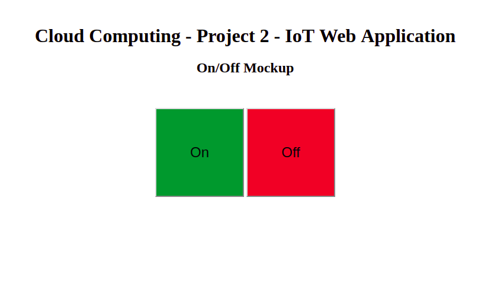

# On-Off Mockup

Possibly the most basic mockup for a website that contains two buttons controlling the on-off functionality of the lightbulb.

The idea here is to integrate the following ```on_off.html``` code into what is generated with the python ```cgi``` framework
but setup to perform actions based on the button press. This would be the simplest implementation of that, pressing a button
to turn the bulb on or off and ensuring the database is updated so that both servers reflect the changes made and share the 
same state of the bulb. 


<p align="center">
  
</p>
